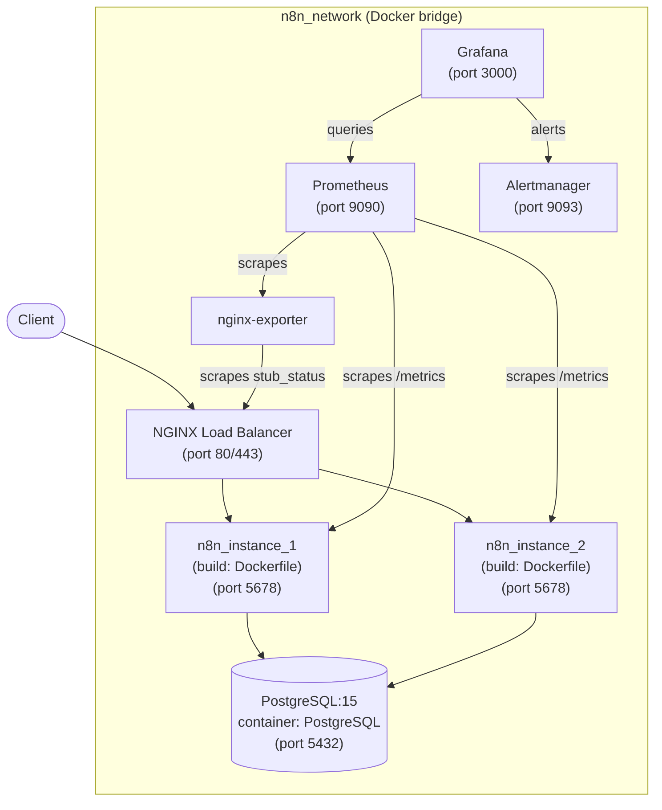

# Аппаратная и сетевая архитектура проекта

## 1. Обзор

Данный документ описывает аппаратную и сетевую архитектуру для отказоустойчивого и масштабируемого развёртывания n8n. Конфигурация состоит из двух экземпляров сервера n8n за балансировщиком нагрузки NGINX, базы данных PostgreSQL, управляемой через Docker Compose, и стека мониторинга. Все сервисы используют единую мостовую сеть Docker (`n8n_network`), что обеспечивает прямое межконтейнерное взаимодействие по имени сервиса.

## 2. Схема архитектуры

## 3. Компоненты

### 3.1. Балансировщик нагрузки

*   **Назначение:** Балансировщик нагрузки является единой точкой входа для всего входящего трафика к экземплярам n8n. Он отвечает за:
    *   **Распределение трафика:** Распределение входящих запросов между двумя серверами n8n для обеспечения высокой доступности и балансировки нагрузки.
    *   **Терминация SSL/TLS:** Разгрузка серверов n8n от операций шифрования и дешифрования SSL/TLS.
    *   **Управление доступом:** Может быть настроен с правилами для контроля доступа к экземплярам n8n.
*   **Технология:** Это может быть облачный балансировщик нагрузки (например, AWS ELB, Google Cloud Load Balancing) или самостоятельно размещённое решение (например, NGINX, HAProxy).

### 3.2. Серверы n8n

*   **Экземпляры:** Два экземпляра сервера n8n (`n8n_instance_1`, `n8n_instance_2`) работают в одной сети `n8n_network`. NGINX распределяет запросы между ними с использованием алгоритма балансировки `least_conn`.
*   **Пользовательский образ:** Оба экземпляра используют пользовательский `Dockerfile` (многоступенчатая сборка), который добавляет Python 3.12, пакет `@n8n/task-runner-python` и предустановленные узлы сообщества поверх защищённого базового образа `n8nio/n8n:latest`.
*   **Общее состояние:** Оба экземпляра подключаются к одному контейнеру PostgreSQL. Рабочие процессы, учётные данные, журналы выполнения и пользовательские данные разделяются через базу данных.
*   **Порядок запуска:** Директива `depends_on: condition: service_healthy` гарантирует, что n8n запускается только после того, как PostgreSQL успешно пройдёт проверку работоспособности `pg_isready`.

### 3.3. База данных PostgreSQL

*   **Полное управление через Compose:** PostgreSQL работает как сервис Docker Compose (`postgres:15`, имя контейнера `PostgreSQL`) в сети `n8n_network`. Установка на хост-машину не требуется.
*   **Сохранность данных:** Данные хранятся в именованном томе Docker (`postgres_data`). При миграции с контейнера, запущенного вручную, том может быть подключён как `external: true` для сохранения существующих данных.
*   **Подключение:** n8n подключается к PostgreSQL, используя имя контейнера `PostgreSQL` в качестве имени хоста (DNS-разрешение Docker внутри `n8n_network`). Пул соединений настроен с параметром `DB_POSTGRESDB_POOL_SIZE=10`.

### 3.4. Мониторинг и логирование

*   **Prometheus:** Система мониторинга, которая собирает и хранит метрики из различных источников, включая cAdvisor и Postgres Exporter.
*   **Grafana:** Инструмент визуализации, позволяющий создавать дашборды для мониторинга метрик, собранных Prometheus, и логов из Loki.
*   **Loki:** Система агрегации логов, предназначенная для хранения и запроса логов со всех сервисов.
*   **Promtail:** Агент, который отправляет логи из контейнеров Docker в Loki.
*   **cAdvisor:** Инструмент, предоставляющий метрики использования ресурсов и производительности на уровне контейнеров.
*   **Postgres Exporter:** Инструмент, экспортирующий метрики PostgreSQL для сбора Prometheus.

## 4. Сетевая конфигурация

*   **Единая мостовая сеть `n8n_network`:** Все сервисы (PostgreSQL, экземпляры n8n, NGINX, стек мониторинга) используют одну мостовую сеть Docker. Это обеспечивает межконтейнерное взаимодействие с использованием имён сервисов в качестве DNS-имён хостов (например, `PostgreSQL:5432`, `n8n1:5678`).
*   **Проброшенные порты (хост → контейнер):**
    - `80:80`, `443:443` — NGINX (публичный доступ)
    - `9090:9090` — Prometheus
    - `3000:3000` — Grafana
    - `9093:9093` — Alertmanager
    - `5432:5432` — PostgreSQL (опциональный доступ с хоста для инструментов администрирования)
*   **Усиление безопасности для продакшена:** Для продакшен-среды рекомендуется выделить базу данных в отдельную сеть с ограниченным доступом или использовать управляемый сервис PostgreSQL (например, Yandex Cloud Managed PostgreSQL, Amazon RDS).

Данная архитектура обеспечивает высокую доступность за счёт двух экземпляров n8n с общим персистентным состоянием и предоставляет полноценный стек наблюдаемости через Prometheus, Grafana и Alertmanager.
