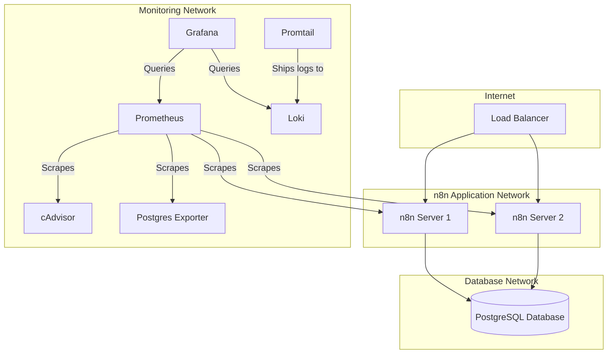

# Project Hardware and Network Architecture

## 1. Overview

This document outlines the hardware and network architecture for a resilient and scalable n8n deployment. The setup consists of two n8n server instances running in separate networks, a load balancer for traffic distribution and access management, and a centralized PostgreSQL database for data persistence. A monitoring and logging stack has been added to provide observability into the system.

## 2. Architecture Diagram

## 3. Components

### 3.1. Load Balancer

*   **Purpose:** The load balancer is the single entry point for all incoming traffic to the n8n instances. It is responsible for:
    *   **Traffic Distribution:** Distributing incoming requests across the two n8n servers to ensure high availability and load distribution.
    *   **SSL/TLS Termination:** Offloading SSL/TLS encryption and decryption from the n8n servers.
    *   **Access Management:** Can be configured with rules to control access to the n8n instances.
*   **Technology:** This can be a cloud-based load balancer (e.g., AWS ELB, Google Cloud Load Balancing) or a self-hosted solution (e.g., NGINX, HAProxy).

### 3.2. n8n Servers

*   **Instances:** Two separate n8n server instances are deployed in different networks (Network A and Network B). This network separation provides redundancy; if one network goes down, the other n8n instance can still operate.
*   **Configuration:** Each n8n server is configured to connect to the same central PostgreSQL database. This ensures that both instances share the same workflows, credentials, and execution data.
*   **Execution:** The load balancer will route workflow executions to either of the n8n instances.

### 3.3. PostgreSQL Database

*   **Centralized Data Store:** A single PostgreSQL database is used as the central repository for all n8n data, including:
    *   Workflows
    *   Credentials
    *   Execution logs
    *   User data
*   **High Availability:** For production environments, it is recommended to use a managed PostgreSQL service with high availability and automated backups (e.g., Amazon RDS, Google Cloud SQL).
*   **Network Security:** The database should be in a secure network (Database Network) and only accessible from the n8n server instances.

### 3.4. Monitoring & Logging

*   **Prometheus:** A monitoring system that collects and stores metrics from various sources, including cAdvisor and Postgres Exporter.
*   **Grafana:** A visualization tool that allows you to create dashboards to monitor the metrics collected by Prometheus and logs from Loki.
*   **Loki:** A log aggregation system designed to store and query logs from all services.
*   **Promtail:** An agent that ships logs from the Docker containers to Loki.
*   **cAdvisor:** A tool that provides container-level resource usage and performance metrics.
*   **Postgres Exporter:** A tool that exports PostgreSQL metrics for Prometheus to scrape.

## 4. Network Configuration

*   **n8n Application Network:** This network contains the n8n server instances and the load balancer.
*   **Database Network:** This network is firewalled to only allow connections from the IP addresses of the n8n servers and the Postgres Exporter.
*   **Monitoring Network:** This network contains all the monitoring and logging services. It has access to the other networks to collect metrics and logs.
*   **Load Balancer Network:** The load balancer resides in a public-facing network to accept traffic from the internet.

This architecture ensures that the n8n service is highly available and resilient to failures in a single server or network, and provides a comprehensive monitoring and logging solution.
