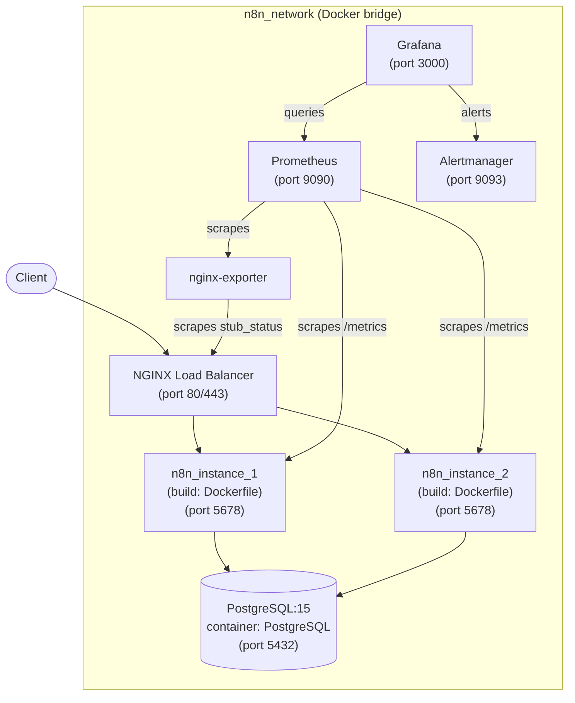

# Project Hardware and Network Architecture

## 1. Overview

This document outlines the hardware and network architecture for a resilient and scalable n8n deployment. The setup consists of two n8n server instances behind an NGINX load balancer, a PostgreSQL database managed by Docker Compose, and a monitoring stack. All services share a single Docker bridge network (`n8n_network`), enabling direct container-to-container communication by service name.

## 2. Architecture Diagram

## 3. Components

### 3.1. Load Balancer

*   **Purpose:** The load balancer is the single entry point for all incoming traffic to the n8n instances. It is responsible for:
    *   **Traffic Distribution:** Distributing incoming requests across the two n8n servers to ensure high availability and load distribution.
    *   **SSL/TLS Termination:** Offloading SSL/TLS encryption and decryption from the n8n servers.
    *   **Access Management:** Can be configured with rules to control access to the n8n instances.
*   **Technology:** This can be a cloud-based load balancer (e.g., AWS ELB, Google Cloud Load Balancing) or a self-hosted solution (e.g., NGINX, HAProxy).

### 3.2. n8n Servers

*   **Instances:** Two n8n server instances (`n8n_instance_1`, `n8n_instance_2`) run on the same `n8n_network`. NGINX distributes requests between them using `least_conn` load balancing.
*   **Custom Image:** Both instances use a custom `Dockerfile` (multi-stage build) that adds Python 3.12, the `@n8n/task-runner-python` package, and pre-installed community nodes on top of the hardened `n8nio/n8n:latest` base image.
*   **Shared State:** Both instances connect to the same PostgreSQL container. Workflows, credentials, execution logs, and user data are shared through the database.
*   **Startup Ordering:** `depends_on: condition: service_healthy` ensures n8n only starts after PostgreSQL passes its `pg_isready` healthcheck.

### 3.3. PostgreSQL Database

*   **Fully Managed by Compose:** PostgreSQL runs as a Docker Compose service (`postgres:15`, container name `PostgreSQL`) on `n8n_network`. No host installation is required.
*   **Data Persistence:** Data is stored in a named Docker volume (`postgres_data`). If migrating from a manually-run container, the volume can be referenced as `external: true` to preserve existing data.
*   **Connection:** n8n connects to PostgreSQL using the container name `PostgreSQL` as the hostname (Docker DNS resolution within `n8n_network`). Connection pooling is configured with `DB_POSTGRESDB_POOL_SIZE=10`.

### 3.4. Monitoring & Logging

*   **Prometheus:** A monitoring system that collects and stores metrics from various sources, including cAdvisor and Postgres Exporter.
*   **Grafana:** A visualization tool that allows you to create dashboards to monitor the metrics collected by Prometheus and logs from Loki.
*   **Loki:** A log aggregation system designed to store and query logs from all services.
*   **Promtail:** An agent that ships logs from the Docker containers to Loki.
*   **cAdvisor:** A tool that provides container-level resource usage and performance metrics.
*   **Postgres Exporter:** A tool that exports PostgreSQL metrics for Prometheus to scrape.

## 4. Network Configuration

*   **Single `n8n_network` bridge:** All services (PostgreSQL, n8n instances, NGINX, monitoring stack) share one Docker bridge network. This enables container-to-container communication using service names as DNS hostnames (e.g., `PostgreSQL:5432`, `n8n1:5678`).
*   **Exposed ports (host → container):**
    - `80:80`, `443:443` — NGINX (public access)
    - `9090:9090` — Prometheus
    - `3000:3000` — Grafana
    - `9093:9093` — Alertmanager
    - `5432:5432` — PostgreSQL (optional host access for admin tools)
*   **Production hardening:** For production, consider separating the database into a dedicated network with restricted access, or use a managed PostgreSQL service (e.g., Yandex Cloud Managed PostgreSQL, Amazon RDS).

This architecture ensures high availability across two n8n instances with shared persistent state, and provides a full observability stack through Prometheus, Grafana, and Alertmanager.
